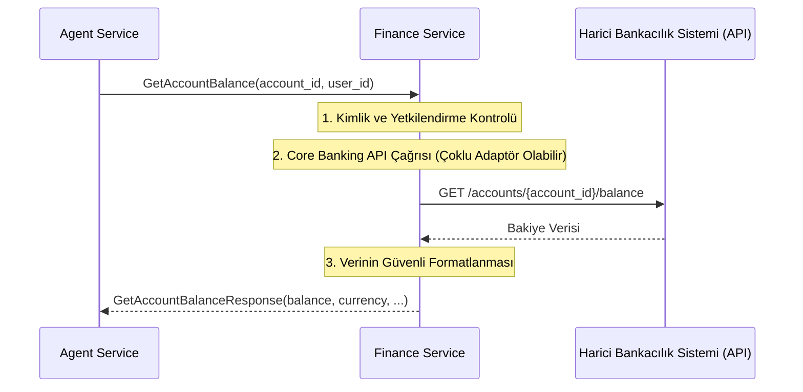

# 🏦 Sentiric Vertical Finance Service - Mantık ve Akış Mimarisi

**Stratejik Rol:** Finans ve bankacılık hizmetlerine özel iş mantığını içerir. Banka bakiyesi, işlem geçmişi veya kredi notu sorgulama gibi hassas ve kritik işlemlere aracılık eder.

---

## 1. Temel Akış: Hesap Bakiyesi Sorgulama (GetAccountBalance)

## 2. Hassasiyet ve Adaptasyon

Finansal veriler en hassas kategoridedir (PCI DSS/KVKK). Bu servis:
* Güvenlik: Tüm iletişimde (harici API ve dahili gRPC) en katı mTLS ve şifreleme kurallarını uygulamalıdır.
* Adaptasyon: Farklı bankaların veya finansal kurumların API'lerini (REST/SOAP) standart FinanceService RPC'lerine çeviren bir adaptör katmanı görevi görür.
* Yetkilendirme: Hesap bakiyesi gibi kritik bilgilere sadece doğru user_id ve tenant_id kombinasyonuna sahip Agent'ların erişimini sağlar.